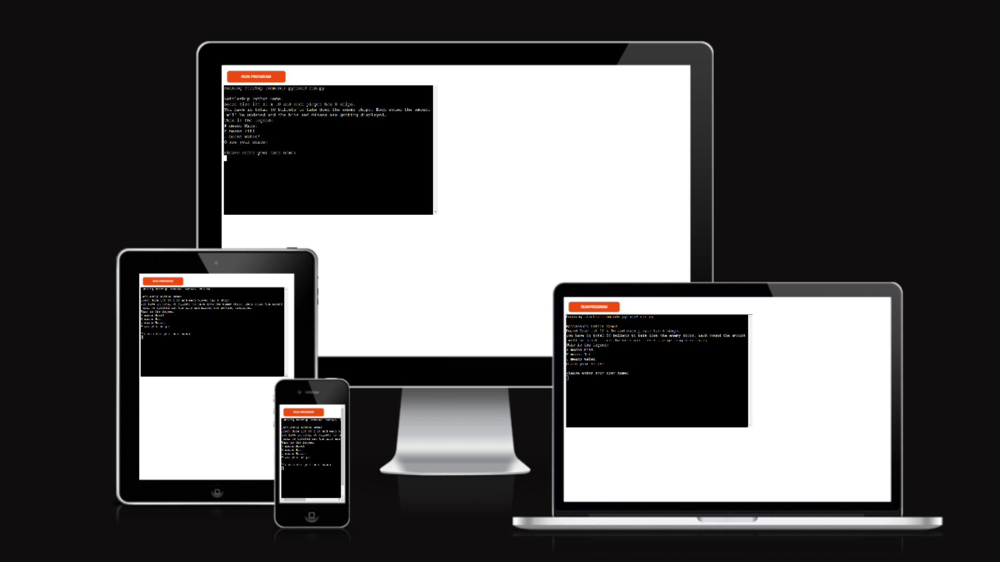

# Battleship Game

The game is a Python terminal project whose primary purpose is to have fun and play it.

Users the classic battleship game and try to win against the computer. In total you play 50 rounds max, and u have to sunk 8 ships from the enemy. 

---

## How to play: 

-Open the game with this URL: https://michaels-battleship-game-d48b393c746c.herokuapp.com/ in your browser
-As soon as the page is loaded, click "Run Program".
-Introduce yourself to the program. 
-Now see your board and the computer board.
-Enter your shot coordinates.
-Play as many round as u finish.