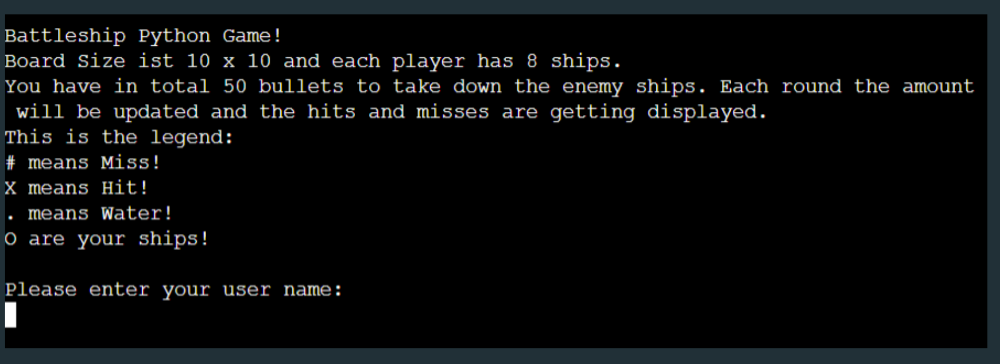
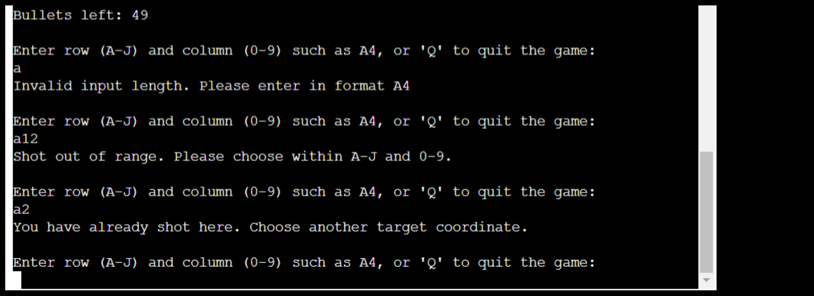
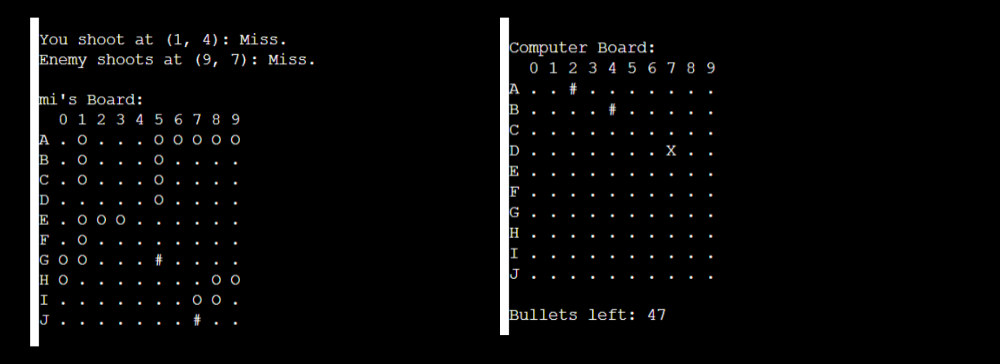
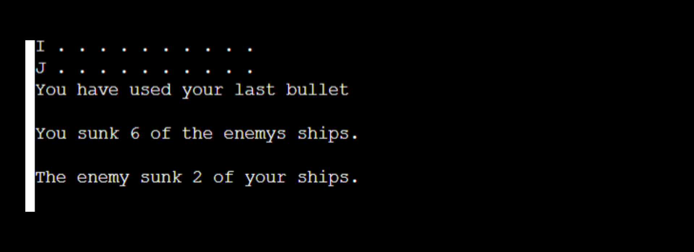
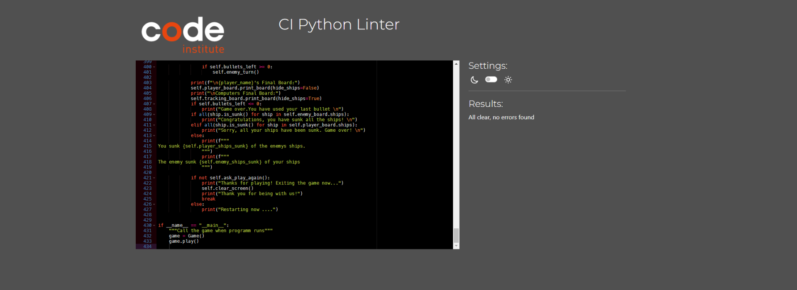
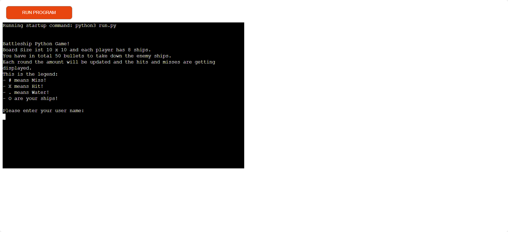

# Battleship Game


The program can be reached by the [link](https://michaels-battleship-game-d48b393c746c.herokuapp.com/)

The game is a Python terminal project whose primary purpose is to have fun and play it.

Users the classic battleship game and try to win against the computer. In total you play 50 rounds max, and u have to sunk 8 ships from the enemy. 

---

## How to play: 

1. Open the game with this URL: https://michaels-battleship-game-d48b393c746c.herokuapp.com/ in your browser
2. As soon as the page is loaded, click "Run Program".
3. Introduce yourself to the program. 
4. Now see your board and the computer board.
5. Enter your shot coordinates.
6. Play as many round as u finish.

---

## User Stories
### First Time Visitor Goals

* As a First Time Visitor, I want to quickly understand the program's primary purpose so that I can learn more about this program.
* As a First Time Visitor, I want to navigate through the program easily so that I can find the content.
* As a First Time Visitor, I want to find the program useful for myself so that I can fulfill my expectations.


### Frequent Visitor Goals:

* As a Frequent User, I want to be able to win the game and use it on my phone.
* As a Frequent User, I want the game to be difficult. 

---

## Features

**When the program is loaded**

* The user can see a welcoming message which engages to start playing and the polite question to enter the user name:



* When the user enters its name, the game shows the 2 players board. 
* On the player board the player can see the location of its ships.
* On the computers board the player only sees the water marks
* Futher more the player can see the amount of bullets. 
* Last but not least the input field to place the shot coordinates. 
* Input validation and error checking
    * You cannot enter coordinates outside the size of the grid
    * You must enter in a specific format like A4
    * You cannot enter the same coordinates twice

* After each shot input the shot will be displayed on either the player board or enemy board.
* Each shot represents either a hit "X" or a miss "#".

* As soon as the game is over the player reseaves a message that all the bullets are out.
* Furthermore, the amounts of ships that the player and the computer sunk are displayed. 

* After this message, the player can choose to quit the game or restart the game.
* "No" will exit the game and leave a thank you message.
* "Yes" will restart the game

---

## Technologies Used

### Languages:

- [Python 3.12.1](https://www.python.org/downloads/release/python-3121/) was used to anchor the project and direct all application behavior

- [JavaScript](https://www.javascript.com/) was used to provide the start script needed to run the Code Institute mock terminal in the browser


### Frameworks/Libraries, and Tools:
#### Python modules:

##### Standard library imports:
- [random](https://docs.python.org/3/library/random.html) was used to implement pseudo-random number generation.
- [os](https://docs.python.org/3/library/os.html ) was used to clear the terminal before and after running the program.

##### Third-party imports:
- None.

#### Other tools:
- [Codeanywhere](https://codeanywhere.com/) was used as the main tool to write and edit code.
- [Git](https://git-scm.com/) was used for the version control of the website.
- [GitHub](https://github.com/) was used to host the code of the website.
- [Canva](https://www.canva.com/) was used to make and resize images for the README file.
- [Heroku](https://www.heroku.com/) was used to deploy the project.

---

## Bugs

**Solved Bugs**

1. Fix bug to display enemy shot on the player board tool
- Solution: change the board from "enemy_board" parameter to "player_board" parameter in the enemy_turn method
```
        "from this"
   def enemy_turn(self):
        row, col = random.randint(0, self.player_board.size - 1), random.randint(0, self.player_board.size - 1)
        print(f"Enemy shoots at ({row}, {col}): ", end= "")
        hit = self.shoot(self.enemy_board, row, col, is_player_shooting = False) 

        "to this"

        print(f"Enemy shoots at ({row}, {col}): ", end="")
        hit = self.shoot(self.player_board, row, col, is_player_shooting=False)
        print("Hit!" if hit else "Miss.")
```

2. Fix bug so the ships are not overlapping and cannot be placed twice on the board
- Solution add the following nested loop in the try_to_place_ship method
```
for r in range(start_row, end_row + 1):
            for c in range(start_col, end_col + 1):
                if board.grid[r][c] == "O":
                    return False
```


**Unsolved bugs**

- None

---

## Testing

The program was tested constantly during its development process.
Other users also tested it in order to spot possible mistakes that the code may present.

### Validation

* PEPE8 Python Validator [online validation tool](https://pep8ci.herokuapp.com/) was used to ensure that all the code is correct. 
* This validation was done manually by copying python code and pasting it into the validator.

No errors were found:



---

## Deployment

- The program was deployed to [Heroku](https://dashboard.heroku.com).
- The program can be reached by the [link](https://michaels-battleship-game-d48b393c746c.herokuapp.com/)



### To deploy the project with heroku:

- Steps for deployment:
1. Fork or clone this repository
2. Create a new Heroku app
3. Set the buildbacks to **Python** and **NodeJs** in that order
4. Link the Heroku app to the repository
5. Click on deploy manually

### To deploy the project as an application that can be **run locally**:

*Note:*
  1. This project requires you to have Python installed on your local PC:
  - `sudo apt install python3`

  2. You will also need pip installed to allow the installation of modules the application uses.
  - `sudo apt install python3-pip`

Create a local copy of the GitHub repository by following one of the two processes below:

- Download ZIP file:
  1. Go to the [GitHub Repo page](https://github.com/elkocho1/battleship-game.git).
  2. Click the Code button and download the ZIP file containing the project.
  3. Extract the ZIP file to a location on your PC.

- Clone the repository:
  1. Open a folder on your computer with the terminal.
  2. Run the following command
  - `git clone https://github.com/elkocho1/battleship-game.git`

---

## Credit

- The inspiration for the game funtion comes from [Python Curriculum](Battleships/battleships_complete.py), they designed the game as a single player mode and was the orientation for my project logic

---

## Acknowledgemnt

- [Juliia Konovalova](https://github.com/IuliiaKonovalova) is my mentor who keeps my journey alive and im so thankful for her help.
- [Python Curriculum](https://github.com/SaranSundar/PythonCurriculum) these projects help me learn more about python and give me a deeper practical introduction